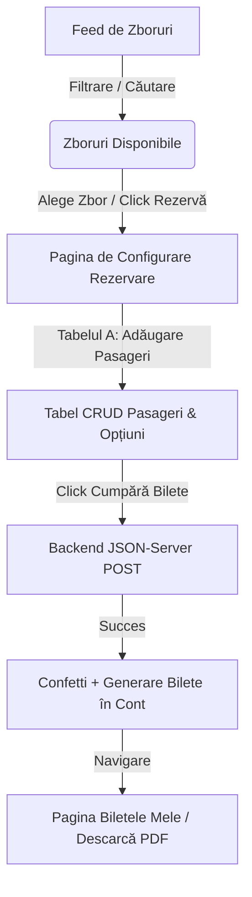

# Plan de Implementare: SkyPass - Flight Booking & Travel Planner (Angular 21)

Proiectul **SkyPass** este o aplicație web de rezervări de bilete de avion și jurnal personal de călătorii ("Travel Planner"), dezvoltată în **Angular 21** (folosind cele mai noi standarde precum Standalone Components, Signal Inputs/Outputs și Signal Queries). Aplicația utilizează **NgZorro** pentru o interfață vizuală premium, un mock backend bazat pe **`json-server`** și integrează efecte interactive (confetti și descărcare bilete în format PDF).

---

## User Review Required

> [!IMPORTANT]
> Proiectul va folosi **Angular 21** cu o arhitectură 100% Standalone (fără module) și va implementa noile mecanisme reactive (Signals complet integrate pentru stări, formulare și fluxuri asincrone).
> 
> Stilul vizual va fi de tip "Glassmorphic Premium Airline App", folosind palete cromatice de lux (albastru marin profund, accente aurii/cyan și fundaluri semi-transparente cu blur).

---

## Fluxul Utilizatorului: Căutare, Selectare și Cumpărare

Pentru a oferi o experiență autentică de e-commerce, fluxul principal este structurat astfel:

### 1. Feed-ul cu Bilete de Avion (Flight Feed)
Pagina principală a utilizatorului autentificat conține un **Feed Interactiv de Zboruri**. Acesta se comportă ca un motor de căutare modern:
* **Filtre în timp real:** Selectare Aeroport Plecare, Aeroport Sosire, Dată călătorie și preț maxim.
* **Feed-ul propriu-zis:** O grilă de carduri elegante (`FlightCardComponent`) care afișează:
  * Logo-ul și numele companiei aeriene (ex. Tarom, Lufthansa, Wizz Air).
  * Orele de decolare și aterizare, durata zborului (formatată prin `flight-duration.pipe`).
  * Prețul de pornire (de bază).
  * Indicator pentru zbor direct sau escală.
  * Buton de acțiune: **"Rezervă bilete"** care trimite utilizatorul către configuratorul de bilete.

### 2. Procesul de Cumpărare (Checkout Flow & Tabelul A)
Odată selectat un zbor din feed, utilizatorul este redirecționat către ecranul de configurare a achiziției:
* Aplicația preia detaliile zborului selectat și afișează **Tabelul A (Managerul de Pasageri)**.
* Deoarece un utilizator poate cumpăra mai multe bilete deodată (pentru el și familie/prieteni), el folosește tabelul CRUD pentru a defini fiecare bilet:
  * **Adăugare (Modal):** Adaugă numele pasagerului, pașaportul și configurează clasa (Economy/Business) și bagajul (fiecare opțiune adaugă un cost suplimentar calculat în timp real).
  * **Calcul preț dinamic:** Folosim un **Computed Signal** `totalPrice = computed(...)` care adună prețul de bază al zborului cu opțiunile fiecărui pasager din tabel.
* **Cumpărarea Efectivă:** La apăsarea butonului **"Cumpără Bilete"**, serviciul face un apel REST POST către backend (`db.json`) salvând datele tranzacției, curăță coșul, declanșează `canvas-confetti` și redirecționează utilizatorul spre istoricul său.

---

## Proposed Changes

Vom structura proiectul conform ghidului Angular 21, profitând de performanța crescută a build-urilor Vite:

### 1. Core Service Layer & Stocare Date

#### [NEW] [app.routes.ts](file:///C:/Users/hadna/.gemini/antigravity/scratch/skypass/src/app/app.routes.ts)
* Configurarea rutelor Lazy Loaded:
  * `/login` -> componenta standalone de autentificare.
  * `/register` -> componenta standalone de înregistrare.
  * `/feed` -> feed-ul principal cu bilete de avion.
  * `/checkout/:flightId` -> configuratorul de pasageri și finalizarea achiziției (Tabelul CRUD A).
  * `/my-bookings` -> istoricul rezervărilor efectuate, descărcare PDF și Jurnalul personal de călătorii (Tabelul CRUD B).

#### [NEW] [flight.service.ts](file:///C:/Users/hadna/.gemini/antigravity/scratch/skypass/src/app/core/services/flight.service.ts)
* Gestionează comunicarea cu `json-server` (port 3000):
  * `getAvailableFlights()`: aduce zborurile din catalog pentru feed.
  * `createBooking(bookingData)`: salvează achiziția de bilete în baza de date locală.
  * `getUserBookings(userId)`: preia biletele cumpărate de utilizatorul logat pentru afișarea în istoric.
  * `getFlightLogs()` & CRUD: gestionează zborurile din Tabelul B (jurnalul manual).

---

### 2. Feature Components (Modulele UI)

#### [NEW] [Flight Feed Component](file:///C:/Users/hadna/.gemini/antigravity/scratch/skypass/src/app/features/flight-feed/)
* Containerul principal pentru motorul de căutare.
* Formular NgZorro pentru filtrare (plecare, destinație, dată).
* Afișează feed-ul sub formă de grid dinamic. Dacă nu se găsesc zboruri, afișează o stare goală stilizată (Empty State).

#### [NEW] [Flight Card Component](file:///C:/Users/hadna/.gemini/antigravity/scratch/skypass/src/app/shared/components/flight-card/)
* O componentă reutilizabilă care primește zborul ca signal input:
  * `flight = input.required<Flight>()` (standard Angular 21).
  * `onSelect = output<string>()` (declanșat când se dă click pe "Rezervă").

#### [NEW] [Checkout Component (Tabelul A)](file:///C:/Users/hadna/.gemini/antigravity/scratch/skypass/src/app/features/checkout/)
* Afișează zborul selectat în partea de sus.
* Conține **Tabelul CRUD A** (Pasageri):
  * Utilizatorul adaugă pasageri utilizând `nz-modal`.
  * Câmpurile din modal sunt verificate prin Validări Reactive (nume obligatoriu, pașaport validat cu regex custom).
  * Modificarea opțiunilor (clasa de zbor, bagaje suplimentare) recalculează instant prețul prin Signals.
  * Buton de ștergere cu `nz-popconfirm`.
  * Butonul de **"Confirmă Achiziția"** care efectuează cumpărarea în baza de date locală, pornește confetti-ul și curăță starea.

#### [NEW] [My Bookings & Travel Logs Component (Tabelul B)](file:///C:/Users/hadna/.gemini/antigravity/scratch/skypass/src/app/features/my-bookings/)
* **Secțiunea 1: Biletele Mele Cumpărate:**
  * Listă cu biletele cumpărate din feed.
  * Buton de **"Descarcă Bilet PDF"** (integrare `jspdf` care generează un format premium de bilet direct în descărcări).
* **Secțiunea 2: Jurnal Personal de Zboruri (Tabelul CRUD B):**
  * Tabelul unde utilizatorul poate adăuga manual zboruri trecute cu scop de catalogare (jurnal).
  * Modale pentru adăugare și editare înregistrări.
  * Sortare pe fiecare coloană și căutare prin searchbar.

---

## Plan Detaliat pe Pași (Roadmap)

### Pasul 1: Inițializarea Proiectului și Dependențe
1. Generarea proiectului Angular 21:
   `npx -y @angular/cli@latest new skypass --style=css --routing --standalone`
2. Adăugarea bibliotecii de UI **NgZorro**:
   `ng add ng-zorro-antd`
3. Instalarea bibliotecilor pentru bonusuri:
   `npm install jspdf canvas-confetti --save`
   `npm install @types/canvas-confetti --save-dev`
4. Pornirea mock backend-ului:
   * Crearea fișierului `db.json` cu trei tabele: `flightsCatalog` (stocul de zboruri pentru feed), `bookings` (biletele cumpărate) și `flightLogs` (jurnalul personal manual).
   * Rularea backend-ului: `json-server --watch db.json --port 3000`

### Pasul 2: Autentificarea (Login & Register)
1. Pagina de login cu suport pentru "Remember me" (stocat în `localStorage`).
2. Pagina de register cu validator custom pentru parola sigură (v21 structure).
3. Legarea la ReqRes API. Securizarea rutelor cu `AuthGuard` bazat pe Signals (`isLoggedIn()`).

### Pasul 3: Feed-ul de Zboruri și Căutarea
1. Crearea serviciului `FlightService` pentru a citi zborurile din backend (`flightsCatalog`).
2. Dezvoltarea paginii de Feed cu design modern (filtre de căutare + grid de carduri).
3. Implementarea pipe-ului `flight-duration` pentru afișarea corectă a duratelor în cardurile din feed.

### Pasul 4: Checkout și Cumpărare (Tabelul CRUD A)
1. Implementarea paginii `/checkout/:flightId` care se deschide când se alege un zbor din feed.
2. Construirea **Tabelului A** (lista de pasageri din coș):
   * Modalul de adăugare/editare pasager (formular cu validări pentru pașaport și nume).
   * Incrementarea prețului final în funcție de clasa biletului și bagajul selectat.
   * Filtrare și sortare locală a pasagerilor din tabel.
3. Implementarea acțiunii de cumpărare: POST către `bookings` în `json-server`, declanșarea efectului de confetti și redirecționarea utilizatorului.

### Pasul 5: Jurnalul Personal (Tabelul CRUD B) și Descărcare PDF
1. Crearea paginii `/my-bookings` cu afișarea rezervărilor efectuate.
2. Generarea biletului PDF folosind **jsPDF**:
   * Layout curat, datele pasagerului, detaliile zborului și un cod QR fictiv.
3. Dezvoltarea **Tabelului CRUD B** (Jurnalul de zboruri efectuate/trecute):
   * Permite adăugarea manuală a zborurilor de către utilizator.
   * Modal de adăugare/editare zboruri trecute cu rating de stele.
   * Sortare pe coloane și filtrare prin searchbar.

---

## Plan de Verificare (Verification Plan)

### Manual Verification
1. **Verificare Cumpărare (Feed -> Checkout):** Navigare în feed, selectare zbor, adăugare 2 pasageri în Tabelul A cu opțiuni diferite de bagaje (Economy + bagaj mediu, Business + bagaj mare). Verificarea calculării prețului final și apăsarea butonului "Cumpără". Verificarea exploziei de confetti și redirecționării.
2. **Persistență în Backend:** Deschiderea fișierului `db.json` de pe disc pentru a confirma că tranzacția a fost salvată corect ca o înregistrare HTTP POST în colecția `bookings`.
3. **Descărcare PDF:** Apăsarea pe "Descarcă Bilet PDF" în pagina `/my-bookings` și verificarea deschiderii fișierului PDF generat, asigurându-te că toate detaliile coincid.
4. **Tabelul B (CRUD Jurnal):** Adăugarea unui zbor manual în jurnal, editarea numărului de stele de la 4 la 5, sortarea tabelului după rating și ștergerea unui zbor vechi.
5. **Verificare Angular 21 Lazy Loading:** Monitorizarea tab-ului Network din consolă pentru a asigura încărcarea componentelor doar la accesarea rutelor.
