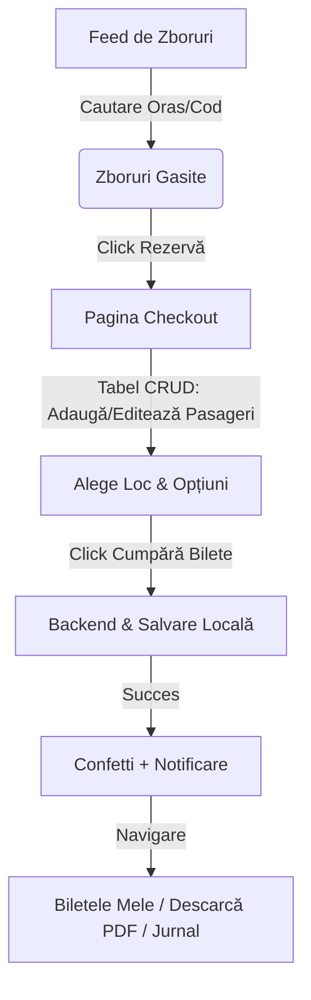

# SkyPass - Flight Booking & Travel Planner (Angular 21) ✈️🌍

Proiectul **SkyPass** este o aplicație web modernă, de nivel „First Class”, destinată rezervărilor de bilete de avion și jurnalizării călătoriilor. A fost dezvoltată folosind cele mai noi standarde din **Angular 21** (Standalone Components, Signals, Computed properties) și oferă o experiență de utilizare extrem de fluidă, comparabilă cu aplicațiile reale din industrie.

Designul vizual este unul exclusivist de tip **"Glassmorphic Premium"**, folosind palete cromatice de lux (albastru marin/Navy profund, accente de cyan neon și fundaluri blurate).

---

## 🌟 Funcționalități Premium & Highlight-uri

Pe lângă cerințele standard, SkyPass include funcționalități avansate de User Experience (UX):
* **Harta Interactivă a Avionului (Seat Selection):** Utilizatorul își poate alege vizual scaunul în avion direct pe o mini-hartă grafică.
* **Skeleton Loaders:** Animații moderne de încărcare a zborurilor pentru a elimina senzația de așteptare.
* **Descărcare Bilet PDF:** Generare reală de bilete în format PDF (cu `jspdf` și `qrcode`) ce conțin toate detaliile zborului.
* **Imagini Dinamice pentru Destinații:** Cardurile de zbor afișează automat fotografii (thumbnails) cu atracții specifice din orașul de destinație.
* **Efect de Confetti (`canvas-confetti`):** O explozie vizuală de confetti la finalizarea cu succes a unei tranzacții.
* **Avatar Dinamic în Navbar:** Generarea automată a inițialei utilizatorului în meniul superior, similar cu conturile Google.

---

## 📋 Acoperirea Baremului (Nota 10 / 100%)

Acest proiect a fost structurat pentru a respecta cu strictețe toate cerințele academice/tehnice:

1. **Login + Register (2.5p):**
   - Formular de Login cu opțiunea funcțională **"Remember Me"** (persistată diferențiat prin `localStorage` vs `sessionStorage`).
   - Formular de Register complet (Nume, Prenume, Email, Parolă, Confirmare Parolă).
   - Validare Custom: `passwordStrengthValidator` (minim 6 caractere, 1 literă mare, 1 literă mică, 1 cifră, 1 caracter special).
   - Securitate: Rutele sunt protejate cu `AuthGuard` și `NoAuthGuard` (pagina de login e ascunsă după logare).
   - **Conectare la API (Reqres.in):** Implementată prin cereri reale HTTP POST către `https://reqres.in/api/login` folosind `HttpClient`.
2. **Arhitectură Fully Lazy Loaded (0.5p):**
   - Toate paginile sunt lazy-loaded prin `loadComponent` în `app.routes.ts`.
3. **Mecanisme de Bază Angular (0.5p):**
   - Implementare extinsă de servicii (`FlightService`, `AuthService`).
   - Transmiterea datelor între componente utilizând noile `input.required<T>()` și `output()`.
4. **Implementare Tabel / Listă Avansată (3p):**
   - Pagina Checkout include **Tabelul Pasagerilor** cu 7 coloane complexe (Nume, Pașaport, Clasă, Bagaj, Loc, Preț, Acțiuni).
   - **Modale (Adăugare & Editare):** Utilizatorul poate adăuga pasageri noi printr-un formular cu validatori sau îi poate modifica apăsând butonul de „Editare”.
   - **Sortare Integrală:** Tabelul poate fi sortat ascendent/descendent pe **fiecare coloană**.
   - Căutare prin searchbar și buton de ștergere (cu pop-confirm).
5. **Folosirea Signals (0.5p):**
   - Aplicația este construită 100% cu `signal()` și `computed()` pentru state management fluid.
6. **Librărie UI (1p):**
   - S-a utilizat intensiv **NgZorro (Ant Design)** pentru carduri, tabele, butoane, mesaje, avatare și dropdown-uri.
7. **Cod Curat & Organizare (0.5p):**
   - Arhitectură pe foldere clare: `core/`, `shared/`, `features/`.
8. **Aspect Plăcut (0.5p):**
   - Design modern, dark-mode nativ, responsive și fără bug-uri vizuale.
9. **Tehnologie la Zi (1p oficiu):**
   - Proiectul rulează pe cea mai recentă versiune, **Angular 21**.

**Bonusuri Incluse:**
- Librării externe adăugate: `jspdf` (pentru bilete PDF) și `canvas-confetti` (pentru UX).
- Funcționalități extra: Filtre de zboruri inteligente (după nume oraș sau IATA), Avatar generativ, Harta Scaunelor.

---

## ⚙️ Fluxul Principal al Aplicației

## 🚀 Rularea Proiectului Local

1. Asigură-te că ai instalat **Node.js**.
2. Clonează acest repository (sau deschide folderul proiectului).
3. Rulează în terminal `npm install` pentru a descărca pachetele.
4. Rulează `npm start` sau `ng serve`.
5. Deschide browserul la adresa `http://localhost:4200`.

*(Pentru conectarea optimă via API, poți folosi contul demo oferit de ReqRes: `eve.holt@reqres.in` / orice parolă, sau poți crea propriul tău cont folosind pagina de Înregistrare a aplicației).*
